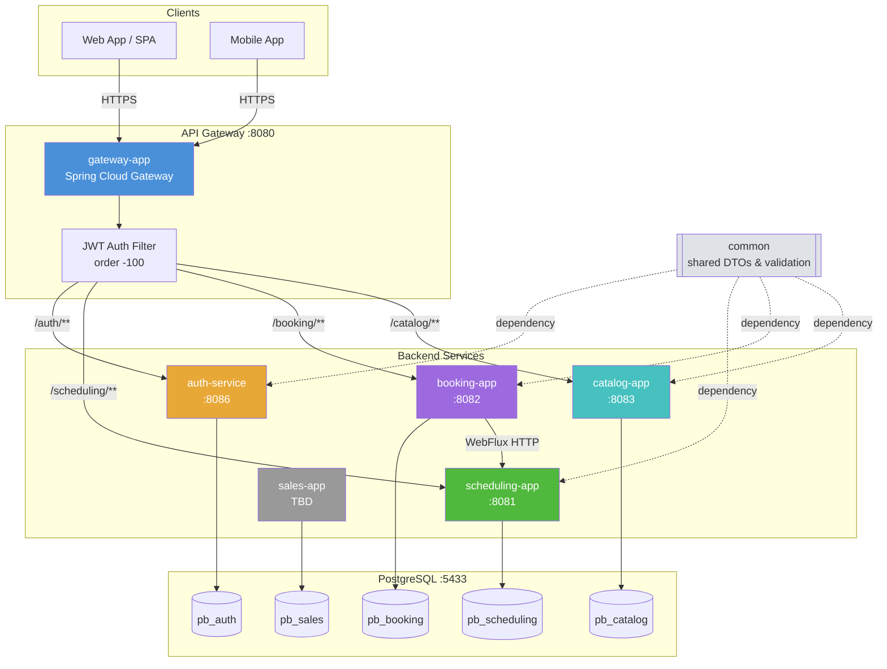
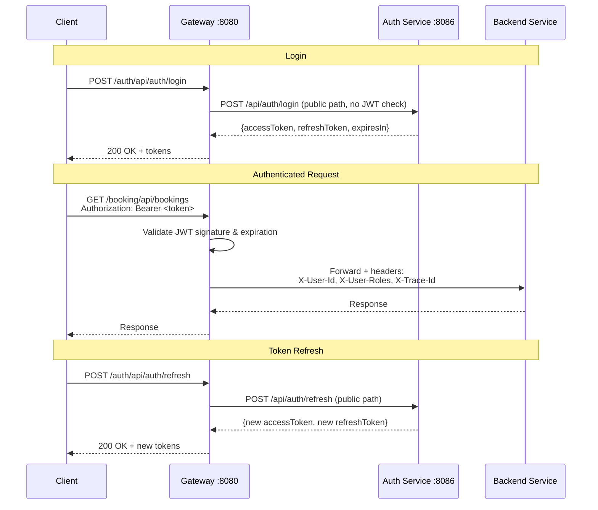
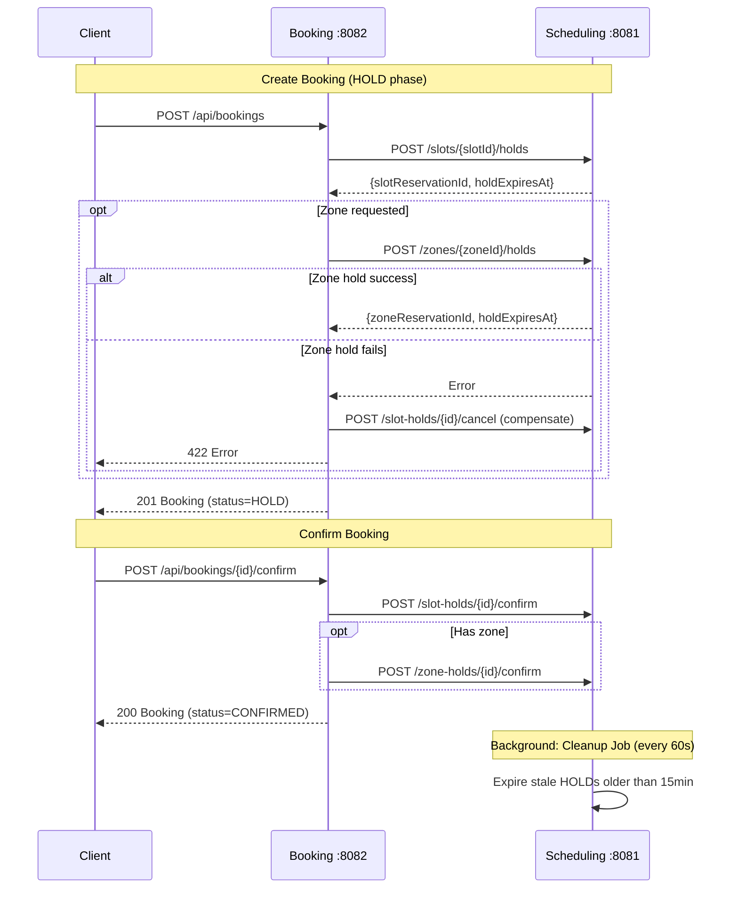
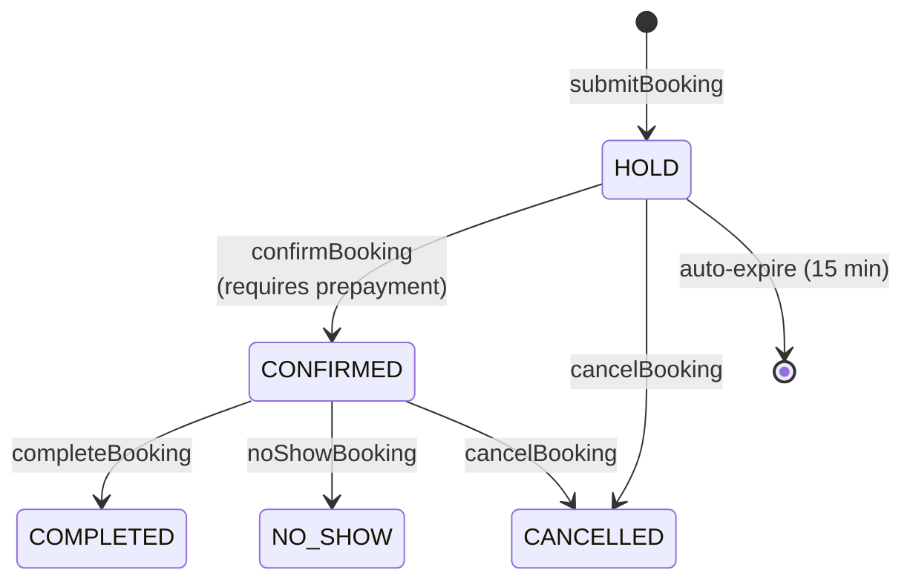
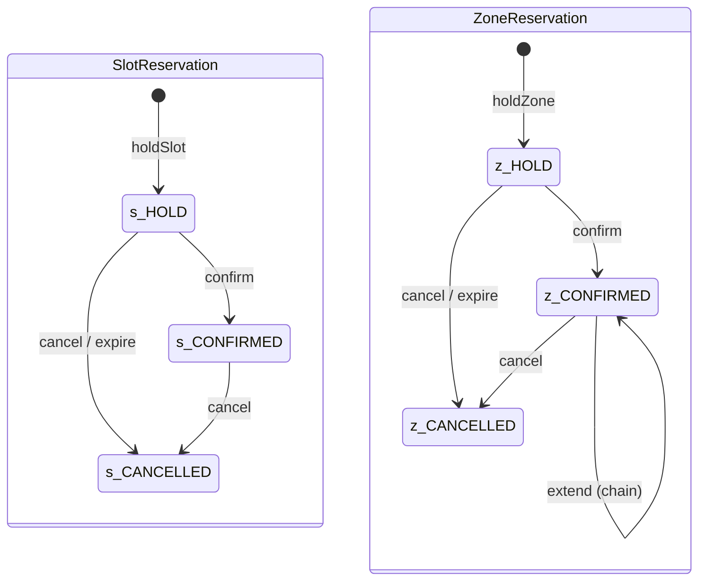
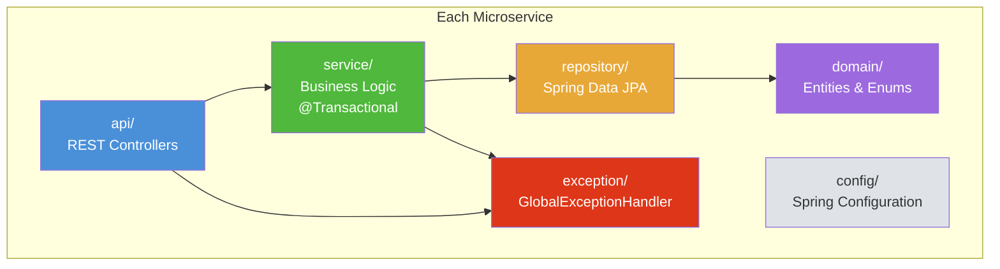
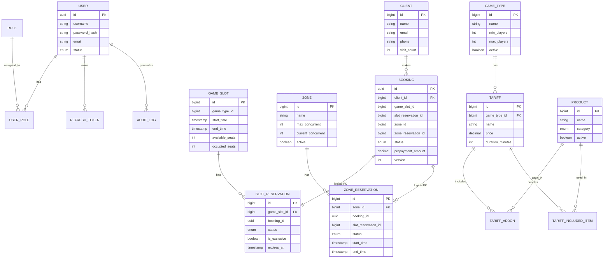
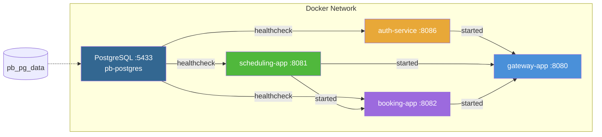

# Backend Architecture

## System Overview

## Authentication Flow

## Booking Two-Phase Commit (Saga)

## Booking State Machine

## Reservation State Machines

## Service Layer Architecture (per service)

## Database Schema (ER Overview)

## Docker Compose Topology

## Technology Stack

| Layer | Technology |
|-------|-----------|
| Language | Java 21 |
| Framework | Spring Boot 3.2.5 |
| Gateway | Spring Cloud Gateway (2023.0.1) |
| Security | Spring Security + JJWT 0.12.6 |
| ORM | Spring Data JPA + Hibernate |
| Migrations | Flyway |
| Database | PostgreSQL 16 |
| HTTP Client | Spring WebFlux WebClient |
| API Docs | SpringDoc OpenAPI 2.5.0 |
| Testing | JUnit 5 + Mockito |
| Build | Maven (multi-module) |
| Containers | Docker (eclipse-temurin) + Docker Compose |

## Ports & Databases

| Service | Port | Database | Schema | Status |
|---------|------|----------|--------|--------|
| gateway-app | 8080 | - | - | MVP |
| auth-service | 8086 | pb_auth | auth | MVP |
| scheduling-app | 8081 | pb_scheduling | scheduling | MVP |
| booking-app | 8082 | pb_booking | booking | MVP |
| catalog-app | 8083 | pb_catalog | catalog | Skeleton |
| sales-app | TBD | pb_sales | sales | Skeleton |
